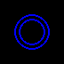

# Summary
This project is built on [PyGame](https://www.pygame.org/wiki/about) and
inspired by the [Build Asteroids](https://www.boot.dev/lessons/5be3e3bd-efb5-4664-a9e9-7111be783271)
guided project on [Boot.dev](https://www.boot.dev/tracks/backend).

After completing the lessons of a project I have further enriched the game with 
features, optimizations, and additional gameplay aspects - some of which will be 
discussed below in this README.

# How to run this project

This project uses Python 3, Python Virtual Environments, and the Package
Installer for Python, PIP

1. Install `python`
1. Clone this repository
1. Activate the Virtual Environment by running `source ./venv/bin/activate`
    - Your shell should now show `(venv)` as a prefix in your prompt
1. Install packages by running `pip install -r requirements.txt`
1. Launch the game by running `python main.py`

# Gameplay

## Controls
- W / UP - Thrust Forward
- S / DOWN - Thrust Backward
- A / LEFT - Rotate Counter Clockwise
- D / RIGHT - Rotate Clockwise
- Q - Retro Thrusters (Brakes)
- SPACE - Fire Blaster 

## Asteroids
Asteroids come in multiple sizes. When larger asteroids are blasted, they often
break into small pieces.

## Ship Modifiers
Periodically you will spot non-asteroid objects floating through space. These
are ship modifiers, upgrades to your ship.

### Fire Rate Increase

This will increase your blaster's fire rate. The effect stacks as more modifiers
are collected.

### Shield Generators

Adds a temporary shield to your ship. Shields collapse when they come into
contact with an asteroid, disipating its total energy into the rock and
destroying it completely.

# Behind the Scenes

## Geometry Intersection 

## Circles

Collision detection of two circles, given their respective centers and radii, is
rather trivial.

Simply compare the distance between the two centers with the value of the
combined radii, if the distance between the origins is greater than the total
combined radii, the circles do not intersect, and thus do no collide. However if
the sum of the radii is greater than the distance between the centers, the
cirlces do intersect.

## Line Segments

## Circle and a Line Segment
High Level Algorithm
[NEED A DIAGRAM]()
- Find the point on the line segment nearest to the circle's origin
- Find the point on the line segment farthest from the circle's origin
- If the distance to the nearest point is less than the radius, and the
    distance to the farthest point is larger than the radius, the line
    segment intersects the circle, otherwise it does not.
- Note: Line segment can be enclosed within the circle and not intersect.

The Math
The point on the line segment that is closest to the circle, is the
projection of the circle's origin onto the line, call it `P`.

To determine if `P` would land on the line segment, we can check if the dot
product of the vectors drawn from the ends of the line to the origin and
line segment itself, if both are greater than zero, indicating the angle
between the vectors is less than 90 degrees, the point P lands on the line.

If this is not the case, `P` is not on the line, and cannot be the nearest
point to the circle. If it is not the nearest point, one of the ends of
the line segment will be the nearest point to the circle.

When calculating distances, we will use their squares, to avoid costly
square root calculations.

### Dot Product of Vectors

The projection of the circles origin onto the line segment you say - how does
one find that? Dot Products!

### Optimizations via Geometry Constraints

### Circles First

When checking for collisions, simplified geometries can be used to quickly
evaluate if two shapes are even close enough to one another to collide. For
example, we've already seen how arithmetically simple it is to check if two
circles intersect, if we have a more complex geometry, like a polygon, we can
use a circular bounding region to create a fast preliminary check before
evaluating a collision with a more intensive polygon algorithm.

## Game Engine + Mechanics

### Conventions
Rotations are measured clockwise from north. The Y axis of the screen runs
south.

### Circles

## Attribution

### Audio
All audio files were pulled from the GDC 2019 provided collection, available for
use from [here](https://sonniss.com/gameaudiogdc/).

interface-beep - Part 1/SciFi Interface/Beep

